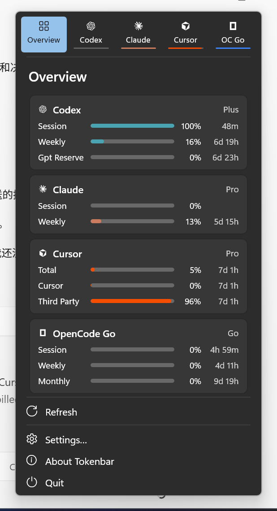

# Tokenbar

A native Windows 11 tray app that shows how much of your AI coding tool quotas you've used — Codex, Claude Code, Cursor, Gemini, Antigravity, OpenCode (Zen / Go), Grok and OpenRouter.

The panel, tray meter and quota layout follow [CodexBar](https://github.com/steipete/CodexBar) for macOS, rebuilt with WinUI 3 and Fluent (acrylic, system fonts, accent color). All sign-in, cookie and API work is done by the `codexbar` CLI from [Win-CodexBar](https://github.com/nesszer/Win-CodexBar), included as a submodule.



中文：Windows 托盘里看 AI 编程工具用量的小工具，界面照 macOS CodexBar，用 WinUI 3 原生控件重做；取数据交给 Win-CodexBar 的 Rust CLI。

## Build

Requirements: Windows 10 19041+ / Windows 11, .NET 8 SDK, Rust toolchain.

```powershell
git clone https://github.com/enlivatech/Tokenbar.git
cd Tokenbar
git submodule update --init --depth 1
powershell -File scripts\build-cli.ps1      # builds codexbar.exe (~6 min)
dotnet build src\Tokenbar\Tokenbar.csproj -c Debug -p:Platform=x64
src\Tokenbar\bin\x64\Debug\net8.0-windows10.0.19041.0\Tokenbar.exe
```

Without the CLI the app falls back to sample data. Windows 11 puts new tray icons in the overflow (`^`); drag it onto the taskbar.

## Setup

Open **Settings… → Providers**. Each tool has an on/off switch; data sources are picked automatically. Tools that need a secret get an input box (OpenRouter API key; Grok / OpenCode cookie). Secrets go to the CLI over stdin and are stored encrypted with Windows DPAPI.

## Layout

- `src/Tokenbar` — WinUI 3 app (UI only); `Services/CliUsageFetcher.cs` maps `codexbar usage -p <tool> --json` into view models.
- `vendor/Win-CodexBar` — CLI fork ([enlivatech/Win-CodexBar](https://github.com/enlivatech/Win-CodexBar)).
- `scripts/` — CLI build, panel screenshot, tray icon sheet.

## License

MIT, see [LICENSE](LICENSE). Third-party code and assets: [THIRD_PARTY_NOTICES.md](THIRD_PARTY_NOTICES.md).
